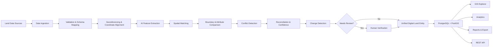

<div align="center">

# 🌍 TERRANODE

### Geospatial Reconciliation & Field Intelligence

**AI-powered multi-source geospatial integration, harmonization, and land-record intelligence platform.**

**ONE PARCEL. ONE TRUSTED VIEW.**


### Team DenkWerk

</div>

---
PROJECT LINK:https://terranode-reconcile.netlify.app

## 📌 Overview

**TERRANODE** is a geospatial reconciliation and field intelligence platform that integrates fragmented land and property information from multiple spatial sources into a unified digital land representation.

It brings together cadastral records, municipal GIS, drone imagery, GNSS/CORS survey data, building footprints, infrastructure, elevation data, and historical records.

TERRANODE automatically validates, aligns, matches, compares, reconciles, and verifies spatial information while maintaining evidence and version history.

---

## 🔄 Core Workflow

```text
MULTI-SOURCE DATA
       ↓
INGEST
       ↓
VALIDATE
       ↓
ALIGN
       ↓
MATCH
       ↓
COMPARE
       ↓
RECONCILE
       ↓
VERIFY
       ↓
UNIFIED DIGITAL LAND ENTITY

# 🚀 Key Features

### 🗂️ Multi-Source Data Integration

TERRANODE integrates different land and spatial data sources:

* Cadastral and land records
* Municipal GIS
* Drone / ORI imagery
* GNSS / CORS survey data
* Building footprints
* DSM / DTM elevation data
* Roads and infrastructure
* Utility networks
* Historical spatial data
* Contextual geospatial data

### 🔍 Data Validation & Preparation

Incoming datasets are validated before entering the reconciliation pipeline.

* File format validation
* Geometry validation
* Attribute validation
* Missing-value detection
* Duplicate detection
* Coordinate validation
* CRS validation
* Metadata inspection

### 🧠 Smart Schema & Attribute Mapping

Different sources may use different field names for the same information.

Examples:

```text
SURVEY_NO / SURVEY_ID / SURVEY_NUMBER / PARCEL_NO
                         ↓
              SURVEY / PARCEL IDENTIFIER
```

```text
OWNER / OWNER_NAME / PROPERTY_OWNER / LAND_HOLDER
                         ↓
                     OWNER NAME
```

TERRANODE maps source fields into a common structure using field-name matching, aliases, data-type validation, value-pattern analysis, semantic mapping, and mapping confidence.

### 📍 Georeferencing & Coordinate Alignment

TERRANODE handles spatial alignment across datasets.

```text
SOURCE CRS
    ↓
CRS DETECTION
    ↓
COORDINATE TRANSFORMATION
    ↓
GEOREFERENCING
    ↓
SPATIAL ALIGNMENT
    ↓
GEOMETRY VALIDATION
```

The system tracks original CRS, detected CRS, processing CRS, display CRS, transformation status, ground-control information, and geometry validation status.

### 🤖 AI Feature Extraction

AI-based image analysis can be used as an additional spatial evidence source.

```text
DRONE / ORI
     ↓
AI FEATURE EXTRACTION
     ↓
BUILDING DETECTION
     ↓
BUILDING FOOTPRINTS
     ↓
SPATIAL RECONCILIATION
```

AI-generated features can be compared against existing land and spatial records.

### 🔗 Spatial Matching

TERRANODE identifies corresponding records across different datasets using:

* Spatial proximity
* Boundary overlap
* Intersection over Union (IoU)
* Centroid distance
* Shape similarity
* Area similarity
* Attribute similarity
* Source evidence

```text
REVENUE PARCEL
      +
MUNICIPAL PARCEL
      +
CADASTRAL PARCEL
      +
SURVEY EVIDENCE
      ↓
SPATIAL MATCHING
      ↓
CORRESPONDING RECORDS
```

### 📐 Boundary & Attribute Comparison

Matched records are compared to identify differences.

**Spatial comparison:**

* Boundary differences
* Area differences
* Centroid drift
* Spatial overlap
* Geometry differences

**Attribute comparison:**

* Identifier differences
* Area differences
* Land-use differences
* Source-field differences
* Missing attributes

### 🧩 Topology Validation

TERRANODE validates spatial geometry and relationships.

It can identify:

* Invalid polygons
* Self-intersections
* Gaps
* Overlaps
* Slivers
* Geometry inconsistencies

### ⚖️ Conflict Detection & Reconciliation

When multiple sources disagree, TERRANODE identifies conflicts and evaluates available evidence.

```text
MULTIPLE SOURCES
       ↓
COMPARE EVIDENCE
       ↓
CONFLICT DETECTION
       ↓
RECONCILIATION
       ↓
CONFIDENCE
       ↓
UNIFIED RESULT
```

Uncertain results can be sent for human verification.

### 🔄 Change Detection

TERRANODE compares different dataset versions to identify observed spatial changes.

```text
PREVIOUS VERSION
       +
CURRENT VERSION
       ↓
CHANGE DETECTION
       ↓
OBSERVED SPATIAL CHANGE
```

Possible changes include:

* Boundary changes
* Area changes
* New buildings
* Removed buildings
* Building footprint changes
* Attribute changes
* New records
* Missing records
* Geometry quality changes

### 🕒 Version Management

TERRANODE preserves previous dataset and parcel states.

```text
VERSION 01
    ↓
VERSION 02
    ↓
VERSION 03
    ↓
CURRENT VERSION
```

Versions can retain:

* Geometry
* Attributes
* Source information
* Evidence
* Confidence
* Review status
* Change history

### 👤 Human Verification

Automation is combined with human verification for uncertain results.

```text
REVIEW
   ↓
COMPARE SOURCES
   ↓
INSPECT EVIDENCE
   ↓
APPROVE / REJECT / ADJUST
   ↓
VERIFIED RESULT
```

### 🛣️ Infrastructure Intelligence

TERRANODE can integrate and analyze spatial infrastructure layers such as:

* Roads
* Drainage
* Water networks
* Electricity
* Railway / Transit
* Public infrastructure

Spatial relationships can be analyzed using:

* Intersection
* Distance
* Overlap
* Crossing
* Nearby features

Infrastructure analysis provides spatial evidence without automatically making legal conclusions.

---

# 🗺️ GIS & 3D Visualization

TERRANODE provides an interactive geospatial environment for spatial inspection.

### 2D GIS

* Parcel boundaries
* Source layers
* Buildings
* Roads
* Infrastructure
* Conflicts
* Ground-truth evidence
* Historical versions
* Change detection

### 3D GIS

* Terrain
* Buildings
* Parcel boundaries
* Infrastructure
* Verified building heights
* Spatial inspection
* 2D ↔ 3D synchronization

---

# 🧠 Reconciliation Engine

The complete TERRANODE processing pipeline:

```text
MULTI-SOURCE DATA
        ↓
DATA INGESTION
        ↓
VALIDATION
        ↓
SCHEMA MAPPING
        ↓
GEOREFERENCING
        ↓
COORDINATE ALIGNMENT
        ↓
NORMALIZATION
        ↓
AI FEATURE EXTRACTION
        ↓
SPATIAL MATCHING
        ↓
GEOMETRY COMPARISON
        ↓
ATTRIBUTE HARMONIZATION
        ↓
TOPOLOGY VALIDATION
        ↓
CONFLICT DETECTION
        ↓
RECONCILIATION
        ↓
CONFIDENCE & EVIDENCE
        ↓
CHANGE DETECTION
        ↓
HUMAN VERIFICATION
        ↓
UNIFIED DIGITAL LAND ENTITY
```

---

# 🏗️ System Architecture



---

# 🛠️ Technology Stack

### Frontend

React · TypeScript · Vite · Tailwind CSS

### Backend

Python · FastAPI · Uvicorn · Pydantic

### Geospatial Processing

GeoPandas · Shapely · PyProj · GDAL · OSMnx

### GIS & Visualization

Leaflet · GeoJSON · 3D GIS

### AI / ML

PyTorch · Computer Vision · Machine Learning

### Database

PostgreSQL · PostGIS · Psycopg

---

# 📁 Project Structure

```text
TerraNode/
│
├── backend/
│   ├── crs/
│   ├── geometry/
│   ├── infrastructure/
│   ├── matching/
│   ├── routers/
│   └── main.py
│
├── frontend/
│   ├── src/
│   │   ├── api/
│   │   ├── components/
│   │   └── views/
│   └── package.json
│
├── data/
├── docs/
├── reports/
├── requirements.txt
├── docker-compose.yml
└── README.md
```

---

# 🔄 Data Flow

```text
SOURCE DATA
     ↓
INGESTION
     ↓
VALIDATION
     ↓
NORMALIZATION
     ↓
ALIGNMENT
     ↓
MATCHING
     ↓
COMPARISON
     ↓
RECONCILIATION
     ↓
VERIFICATION
     ↓
UNIFIED RESULT
     ↓
GIS / ANALYTICS / REPORTS / API
```

---

# 🎯 Key Principles

**Multi-Source**
Combines land, property, survey, imagery, building, infrastructure, and historical spatial data.

**Evidence-Driven**
Reconciliation results are supported by source and spatial evidence.

**Human-in-the-Loop**
Uncertain results can be manually verified.

**Version-Aware**
Historical dataset and parcel states are preserved.

**Explainable**
Results include confidence and supporting evidence.

**Dataset-Isolated**
Different datasets are processed independently to prevent data mixing.

**Interoperable**
Supports standard spatial formats, GIS visualization, APIs, and data exchange.

---

# 👥 Team

### DenkWerk

**TERRANODE — Geospatial Reconciliation & Field Intelligence**

---

# 📄 License

This project is licensed under the MIT License.

```
```
