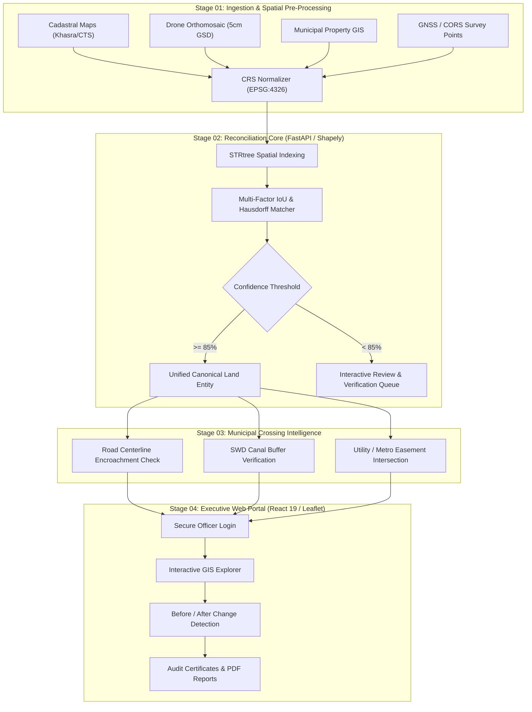

<div align="center">

# 🌍 TerraNode — AI-Powered Geospatial Reconciliation Platform
### *Authoritative Multi-Source Urban Land Records Harmonization & Digital Twin Engine*

[](https://python.org)
[](https://fastapi.tiangolo.com)
[](https://react.dev)
[](https://www.typescriptlang.org)
[](https://vitejs.dev)
[](https://tailwindcss.com)
[](https://leafletjs.com)
[](LICENSE)

*Developed for the National Urban Land Records Modernization Programme (NAKSHA / DILRMP)*  
*Department of Land Resources (DoLR), Ministry of Rural Development, Government of India*

</div>

---

## 📌 Executive Summary

Urban land governance across India suffers from severe spatial and legal fragmentation. Critical records—including **State Cadastral Maps (Khasra/CTS)**, **Municipal Property Tax GIS (BBMP, GCC, MCGM, NDMC)**, **High-Resolution Drone Orthomosaics (5cm GSD)**, **CORS RTK Survey Ground Truths**, and **Satellite Extraction Layers**—are maintained in disparate Coordinate Reference Systems (CRS) with conflicting boundaries and incompatible schemas.

**TerraNode** is an enterprise-grade geospatial reconciliation platform that automates the integration, alignment, conflict resolution, and synchronization of multi-source spatial land records into a single, authoritative **Canonical Digital Land Entity**.

---

## 🚀 Key Innovations & Capabilities

### 1. 📂 Multi-Source Spatial Data Ingestion
- Ingests and standardizes diverse formats: **GeoJSON, Shapefiles, DXF, GeoTIFF, KML, and CSV**.
- **Automated CRS Detection & On-The-Fly Projection**: Converts native state coordinates (`EPSG:7760`, `EPSG:32643`, `EPSG:32644`) into standardized `EPSG:4326` using high-precision geodesy (`pyproj`).

### 2. 🧠 Intelligent Spatial Matching Engine
- **STRtree Spatial Indexing**: Sub-millisecond candidate pairing across tens of thousands of urban parcels.
- **Multi-Factor Consensus Scoring**:
  $$\text{Score}(A, B) = w_1 \cdot \text{IoU} + w_2 \cdot (1 - d_{\text{centroid}}) + w_3 \cdot \text{Hausdorff} + w_4 \cdot \text{AttributeSim}$$
- Ranks consensus confidence from 0% to 100% and flags only genuine discrepancies for human officer review.

### 3. ⚖️ Hierarchical Consensus Matrix & Conflict Resolution
- Eliminates manual GIS adjudication bottlenecks using an authoritative rule engine:
  - **Tier 1 (Legal Authority)**: Revenue Cadastral Boundaries & Statutory Rights-of-Way.
  - **Tier 2 (Physical Ground Truth)**: 5cm GSD Drone Orthophoto & Survey of India CORS GNSS.
  - **Tier 3 (Civic Evidence)**: Municipal Property Tax GIS Assessments.
  - **Tier 4 (AI Extractions)**: SAM-2 / Deep Learning rooftop footprints.

### 4. 🛣️ Infrastructure & Easement Intelligence
- Overlays real-world, high-resolution GIS networks across four major Indian metropolitan areas:
  - **Public Road Corridors**: Carriageway centerlines, arterial widths, and flyovers.
  - **Stormwater Drains (SWD)**: Rajakaluve networks, canals, and statutory buffer zones.
  - **Transit / Railway**: Metro alignments (DMRC, BMRCL, CMRL, MMRDA).
  - **Electricity Easements**: Underground transmission cable banks and distribution feeders.

### 5. 📜 Immutable Audit Ledger & Certification
- Generates cryptographic, tamper-evident **Reconciliation Certificates** for every resolved parcel.
- Complete lifecycle tracking: `DETECTED` $\rightarrow$ `REVIEW` $\rightarrow$ `AUTO-RESOLVED` $\rightarrow$ `OFFICER-CONFIRMED`.

---

## 🗺️ Multi-City Reference Extents

TerraNode features calibrated, isolated datasets spanning four metropolitan regions:

| City | Area of Interest (AOI) | Authority / Sources | Native CRS | Verified Features |
|---|---|---|---|---|
| **Bengaluru** | Ward 112 / Domlur | BBMP, Karnataka Revenue Cadastre, Drone ORI | `EPSG:7760` / `EPSG:32643` | 1,248 Parcels, 9 Infra Layers |
| **Chennai** | T. Nagar Urban Corridor | Greater Chennai Corp (GCC), Town Survey, TIDCO | `EPSG:32644` (UTM 44N) | 840 Parcels, 16 Infra Layers |
| **Mumbai** | Andheri East MIDC | MCGM K/East Ward, CTS Cadastre, MMRDA | `EPSG:32643` (UTM 43N) | 980 Parcels, 12 Infra Layers |
| **Delhi NCR** | Central Secretariat / Central Vista | CPWD, NDMC, DDA Master Plan, DMRC | `EPSG:32643` (UTM 43N) | 72 Key Monuments, 12 Infra Layers |

---

## 🏗️ System Architecture



---

## 📁 Repository Structure

```
Geo-Reconciliation-master/
├── backend/                        # FastAPI reconciliation engine
│   ├── config/                     # Authoritative policies & threshold settings
│   ├── crs/                        # Coordinate transformation & geodetic routines
│   ├── geometry/                   # Shapely/STRtree spatial intersection & buffers
│   ├── infrastructure/             # Utility crossing repository & services
│   ├── matching/                   # IoU, Hausdorff, and attribute matching engines
│   ├── routers/                    # REST API endpoints (parcels, review, sync)
│   └── main.py                     # Backend application entrypoint
│
├── frontend/                       # Modern React 19 + TypeScript + Vite portal
│   ├── public/                     # Public assets and Netlify SPA redirect rules
│   │   └── infrastructure/         # City-isolated GeoJSON layers
│   ├── src/
│   │   ├── api/                    # Thin API client with resilient offline fallbacks
│   │   ├── components/             # Reusable UI cards, modals, and views
│   │   │   ├── AdminLoginPage.tsx  # Secure officer login gateway
│   │   │   ├── DataUploadView.tsx  # Stage 01: Document & package ingestion
│   │   │   ├── GisExplorerView.tsx # Stage 02: Interactive spatial map
│   │   │   ├── HarmonizationView.tsx # Stage 03: Consensus matrix & schema alignment
│   │   │   ├── ReviewQueueView.tsx # Stage 04: Conflict verification queue
│   │   │   ├── AnalyticsView.tsx   # Spatial intelligence metrics & charts
│   │   │   └── ReportsView.tsx     # Immutable audit certificates & PDF export
│   │   └── data/                   # Bundled fallback datasets for 0ms rendering
│   ├── package.json                # Frontend dependencies
│   └── vite.config.ts              # Vite bundler configuration
│
├── data/                           # Ground-truth datasets & spatial layers
│   ├── infrastructure/             # City-structured infrastructure layers
│   │   ├── bengaluru/              # Roads, SWD drains, metro, electricity
│   │   ├── chennai/                # T. Nagar infrastructure networks
│   │   ├── mumbai/                 # Andheri East infrastructure networks
│   │   └── delhi/                  # Central Vista high-precision GIS centerlines
│   └── datasets/                   # Active workspace manifests & OSM footprints
│
├── docs/                           # Technical documentation & specifications
├── reports/                        # Verification benchmarks & readiness audits
├── netlify.toml                    # Netlify production deployment configuration
├── docker-compose.yml              # Containerized multi-service deployment
└── README.md                       # Project documentation
```

---

## ⚡ Getting Started

### Prerequisites
- **Python 3.10+** (with `pip` and virtual environment support)
- **Node.js 18+** or **Node.js 20+** (with `npm`)

### 1. Clone the Repository
```bash
git clone https://github.com/YOUR_USERNAME/TerraNode.git
cd TerraNode
```

### 2. Backend Setup (FastAPI)
```bash
# Create and activate virtual environment
python -m venv venv
# On Windows:
venv\Scripts\activate
# On Linux/macOS:
source venv/bin/activate

# Install dependencies
pip install -r requirements.txt

# Launch FastAPI development server
python -m uvicorn backend.main:app --host 127.0.0.1 --port 8000 --reload
```
The backend API and Swagger documentation will be available at:
- **API Root**: `http://127.0.0.1:8000`
- **Swagger Docs**: `http://127.0.0.1:8000/docs`

### 3. Frontend Setup (React + Vite)
In a new terminal window:
```bash
cd frontend

# Install npm packages
npm install

# Start development server
npm run dev
```
Open **`http://localhost:3000`** in your browser.

---

## 🌐 Deploy to Netlify

TerraNode is pre-configured for instant zero-configuration deployment to **Netlify**:

### Option A: Drag & Drop (Instant 30-Second Deploy)
1. Run `npm run build` in the `frontend/` directory.
2. Visit **[app.netlify.com/drop](https://app.netlify.com/drop)**.
3. Drag and drop the `frontend/dist/` folder into the Netlify window.

### Option B: Continuous Deployment via Git
1. Push this repository to GitHub.
2. In Netlify, click **"Add new site"** $\rightarrow$ **"Import an existing project"** $\rightarrow$ select your GitHub repo.
3. Netlify automatically detects [`netlify.toml`](netlify.toml):
   - **Base directory**: `frontend`
   - **Build command**: `npm run build`
   - **Publish directory**: `dist`
4. Click **Deploy Site**.

*Note: The frontend contains built-in bundled datasets for all 4 cities, so all maps, layers, analytics, and audit tools run in standalone mode in the browser.*

---

## 🛡️ Security, Privacy & DILRMP Compliance

- **Zero Unintended Data Leakage**: Spatial processing is isolated per city/AOI; no parcel geometries cross-contaminate between regions.
- **Strict Role-Based Officer Access**: Guarded authorization flow requiring accredited credentials before accessing spatial records.
- **Statutory Neutrality**: Infrastructure intersections calculate metric overlaps without inferring legal culpability, preserving administrative due process.

---

## 📄 License

This project is licensed under the **MIT License** — see the [LICENSE](LICENSE) file for details.

---

<div align="center">
  <sub>Built with ❤️ for Digital India · NAKSHA Urban Land Records Modernization</sub>
</div>
