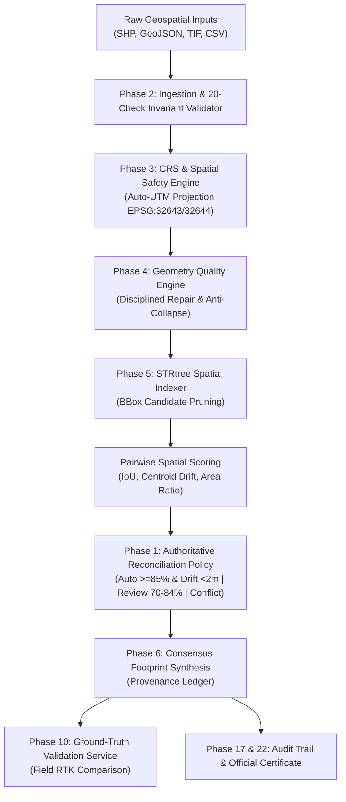

# TERRANODE System Architecture

## 1. High-Level Architecture Overview

TERRANODE is an enterprise geospatial reconciliation platform engineered to ingest, cross-reference, validate, and harmonize disparate land boundary data across multiple government and commercial sources (Revenue Cadastral surveys, Municipal GIS, Satellite/Drone orthomosaics, and Field GNSS RTK survey checkpoints).

## 2. Core Subsystems

1. **Authoritative Reconciliation Policy Engine (`backend/config/reconciliation_policy.py`)**:
   - Single point of truth defining auto-reconciliation, review, and conflict rules.
   - Confidence Formula: $\text{Confidence} = 0.50 \times \text{Match} + 0.35 \times \text{IoU Agreement} + 0.15 \times \text{Extraction}$.
2. **CRS & Metrology Engine (`backend/crs/transformer.py`)**:
   - Strictly enforces projected CRS (meters) for all Euclidean drift and area computations.
   - Prevents calculations on angular degrees.
3. **Geometry Quality Engine (`backend/geometry/validator.py`)**:
   - Returns structured `GeometryValidationResult`. Rejects unsafe repairs where area alters by $> 5\%$.
4. **Spatial Matching & Consensus (`matching/match_entities.py`, `reconciliation/resolve_conflicts.py`)**:
   - STRtree indexing with $O(N \log N)$ complexity.
   - Greedy union-find clustering with same-source collision protection.
5. **Ground Truth Validation (`backend/verification/ground_truth.py`)**:
   - Benchmarks canonical boundaries against GNSS RTK field survey points.
6. **Async Job Processing (`backend/routers/jobs.py`)**:
   - Non-blocking pipeline execution tracking progress from 0% to 100%.
